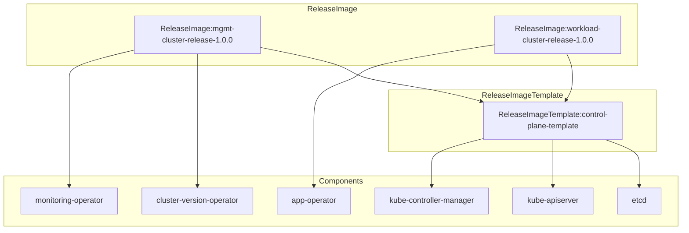

# 设计一个类似openshift ReleaseImage的功能
> 里面包含管理集群与工作集群的各组件的元数据信息，因管理集群与工作集群存在共享控制面组件的场景，还需要设计一个ReleaseImageTemplate的结构，在管理集群与工作集群中可以直接引用ReleaseImageTemplate的内容，请给出详细设计.
> 
设计一个类似 **OpenShift ReleaseImage** 的功能，但要满足你提出的更复杂场景：既有 **管理集群（Management Cluster）**，又有 **工作集群（Workload Cluster）**，并且存在 **共享控制面组件** 的情况。因此需要引入一个 **ReleaseImageTemplate**，作为可复用的组件清单模板。  
## 🎯 设计目标
1. **统一管理**：集中描述管理集群与工作集群的组件元数据。  
2. **模板复用**：共享控制面组件通过 `ReleaseImageTemplate` 定义，避免重复。  
3. **依赖关系**：支持组件之间的依赖定义，保证安装顺序。  
4. **升级路径**：支持候选版本与升级计划。  
## 📑 CRD 设计
### 1. ReleaseImageTemplate（模板定义）
用于描述一组可复用的组件清单，管理集群和工作集群可以引用。
```yaml
apiVersion: release.example.com/v1alpha1
kind: ReleaseImageTemplate
metadata:
  name: control-plane-template
spec:
  version: "1.0.0"
  description: "Shared control plane components"
  components:
    - name: etcd
      type: core
      version: "3.5.10"
      image: "registry.example.com/etcd:3.5.10"
      manifests:
        - config/etcd.yaml
      dependencies: []
    - name: kube-apiserver
      type: core
      version: "1.29.3"
      image: "registry.example.com/kube-apiserver:1.29.3"
      manifests:
        - config/kube-apiserver.yaml
      dependencies:
        - etcd
    - name: kube-controller-manager
      type: core
      version: "1.29.3"
      image: "registry.example.com/kube-controller-manager:1.29.3"
      manifests:
        - config/kcm.yaml
      dependencies:
        - kube-apiserver
```
### 2. ReleaseImage（集群实例）
用于描述某个具体集群的 release 镜像，既可以引用模板，也可以定义额外组件。
```yaml
apiVersion: release.example.com/v1alpha1
kind: ReleaseImage
metadata:
  name: mgmt-cluster-release-1.0.0
spec:
  clusterType: management
  version: "1.0.0"
  releaseTemplateRefs:
    - name: control-plane-template   # 引用共享控制面模板
  components:
    - name: cluster-version-operator
      type: operator
      version: "1.0.0"
      image: "registry.example.com/cvo:1.0.0"
      manifests:
        - operators/cvo-deployment.yaml
      dependencies:
        - kube-apiserver
    - name: monitoring-operator
      type: addon
      version: "0.5.0"
      image: "registry.example.com/monitoring:0.5.0"
      manifests:
        - addons/monitoring.yaml
      dependencies:
        - cluster-version-operator
status:
  availableUpdates:
    - version: "1.1.0"
      image: "registry.example.com/release:1.1.0"
  upgradePlan:
    targetVersion: "1.1.0"
    state: "Pending"
```
### 3. Workload Cluster ReleaseImage
工作集群可以直接引用同一个模板，但定义自己的工作负载组件。
```yaml
apiVersion: release.example.com/v1alpha1
kind: ReleaseImage
metadata:
  name: workload-cluster-release-1.0.0
spec:
  clusterType: workload
  version: "1.0.0"
  releaseTemplateRefs:
    - name: control-plane-template   # 同样引用共享控制面
  components:
    - name: app-operator
      type: addon
      version: "2.0.0"
      image: "registry.example.com/app-operator:2.0.0"
      manifests:
        - addons/app-operator.yaml
      dependencies:
        - kube-apiserver
```
## ⚖️ 设计要点
- **ReleaseImageTemplate**：定义可复用的组件集合（如控制面）。  
- **ReleaseImage**：具体集群的 release，引用模板并补充额外组件。  
- **依赖关系**：通过 `dependencies` 字段保证安装顺序。  
- **升级管理**：在 `status` 中维护 `availableUpdates` 和 `upgradePlan`。  

✅ **总结**：  
这种设计模式实现了 **模板化 + 实例化** 的分离：  
- 模板（ReleaseImageTemplate）负责定义共享组件。  
- 实例（ReleaseImage）负责集群特定组件和升级状态。  
- 管理集群与工作集群都能引用同一个模板，从而保证一致性和复用性。  
## 关系图
直观展示 **ReleaseImage → ReleaseImageTemplate → Components** 的引用关系：  

### 图解说明
- **ReleaseImage**：具体集群的版本定义（管理集群、工作集群）。  
- **ReleaseImageTemplate**：共享的控制面模板（如 etcd、API Server、Controller Manager）。  
- **Components**：实际的组件清单。  
- **关系**：  
  - 管理集群和工作集群都引用同一个模板。  
  - 管理集群额外包含 CVO、监控组件。  
  - 工作集群额外包含应用 Operator。  

这样你就能清晰地看到：**模板负责共享，实例负责扩展**。  
